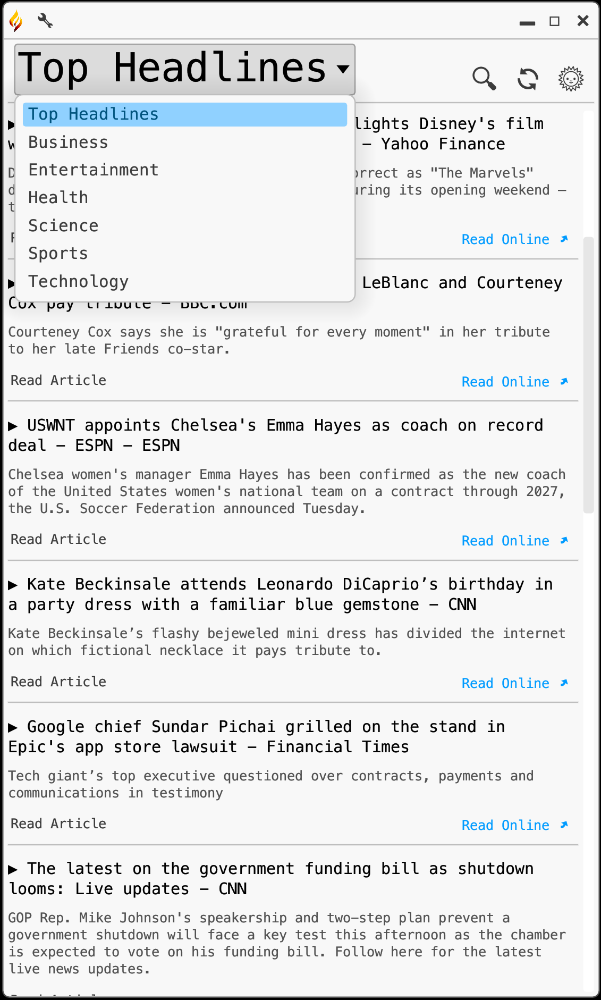

#  Prometheus
---

Student: Ricardo Harris

Degree: Bachelor of Science in Computer Science

Project Advisor: Dr. Sean Hayes

Expected Graduation: December 2023

---

## Description

This project is a newsreader application built in the Rust programming language. It operates as a GUI for the user, sourcing news from http://newsapi.org/.

## Compile/Deploy

To compile this project, first you must <a href="https://www.rust-lang.org/tools/install">install Rust</a>. To compile the Prometheus newsreader application, download the Prometheus/ file from src, then run:
```
cargo run;
```

## Usage

The following usage instructions are from the associated Web Application for the distribution of this product:
<center>
				<table className="Display">
					<thead>
						<th colSpan="2">
							<h3>How to Use</h3>
						</th>
					</thead>
					<tbody>
						<tr>
							<td width="310px" rowSpan="2">
								
							</td>
							<th>
								Running for the First Time
							</th>
						</tr>
						<tr>
							<td>
								When loading Prometheus for the first time, you will find this prompt.&nbsp;
								To begin using Prometheus, follow these steps:
								<ol>
									<li>
										Visit <a href="https://www.newsapi.org/" target="_blank" rel="noopener noreferrer">NewsAPI.org</a>
									</li>
									<li>
										Create your own account
									</li>
									<li>
										Copy your API key
									</li>
									<li>
										Paste in Prometheus
									</li>
								</ol>
								After this, just press enter and you will have access to Prometheus!
							</td>
						</tr>
					</tbody>
					<tr>
						<td colSpan="2">
							<br />
							<hr />
							<br />
						</td>
					</tr>
					<tbody>
						<tr>
							<th>
								Changing Topics
							</th>
							<td width="310px" rowSpan="8">
								
							</td>
						</tr>
						<tr>
							<td>
								To change topics, just click the menu at the top of the application.
							</td>
						</tr>
						<tr>
							<td>
								<br />
							</td>
						</tr>
						<tr>
							<td>
								<br />
							</td>
						</tr>
						<tr>
							<td>
								<br />
							</td>
						</tr>
						<tr>
							<td>
								<br />
							</td>
						</tr>
						<tr>
							<td>
								<br />
							</td>
						</tr>
						<tr>
							<td>
								<br />
							</td>
						</tr>
					</tbody>
					<tr>
						<td colSpan="2">
							<br />
							<hr />
							<br />
						</td>
					</tr>
					<tbody>
						<tr>
							<td width="310px" rowSpan="8">
								
							</td>
							<th>
								Accessing Articles
							</th>
						</tr>
						<tr>
							<td>
								To access an article in Prometheus, you just need to click the "Read Article"&nbsp;
								button.
							</td>
						</tr>
						<tr>
							<td>
								<br />
							</td>
						</tr>
						<tr>
							<td>
								<br />
							</td>
						</tr>
						<tr>
							<td>
								<br />
							</td>
						</tr>
						<tr>
							<td>
								<br />
							</td>
						</tr>
						<tr>
							<td>
								<br />
							</td>
						</tr>
						<tr>
							<td>
								<br />
							</td>
						</tr>
					</tbody>
					<tr>
						<td colSpan="2">
							<br />
							<hr />
							<br />
						</td>
					</tr>
					<tbody>
						<tr>
							<th>
								Searching for Articles
							</th>
							<td width="310px" rowSpan="2">
								
							</td>
						</tr>
						<tr>
							<td>
								<br />
								Alternatively, you can search for articles using the search button.&nbsp;
								There are several ways you can search for a term:
								<ul>
									<li>Enter a term for a general search</li>
									<li>For an exact match, surround your phrase with quotes</li>
									<ul><li>"example"</li></ul>
									<li>For words that must appear, prepend them with a + symbol</li>
									<ul><li>include this +example</li></ul>
									<li>You can further customize your search using AND/OR/NOT</li>
									<ul><li>search this NOT that</li></ul>
								</ul>
							</td>
						</tr>
					</tbody>
					<tr>
						<td colSpan="2">
							<br />
							<hr />
							<br />
						</td>
					</tr>
					<tbody>
						<tr>
							<td width="310px" rowSpan="2">
								
							</td>
							<th>
								Settings
							</th>
						</tr>
						<tr>
							<td rowSpan="3">
								There are several settings you can use to customize&nbsp;
								your experience.
								<ul>
									<li>To access the Country and Text Size menus, click the Settings button at the top of the frame</li>
									<ul>
										<li>You can scroll through the list of available countries</li>
										<li>You can also set a new text size for readability</li>
									</ul>
									<li>If you like a darker experience, you can toggle Night Mode</li>
								</ul>
							</td>
						</tr>
					</tbody>
				</table>
			</center>
